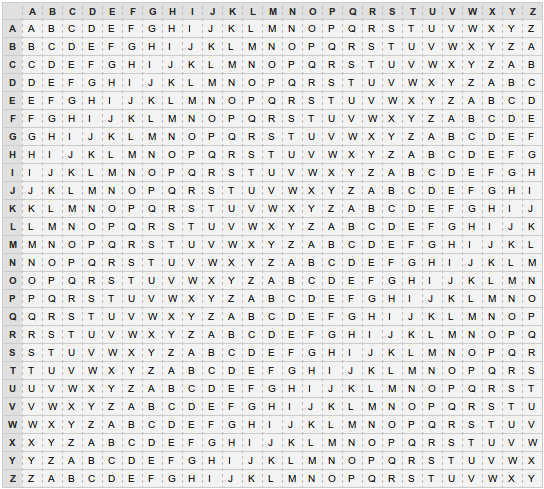

# Initiation à la cryptographie

## Description

On souhaite implémenter différents algorithmes de cryptographie.

### Contexte

Module: Initiation à la cryptographie  
Master 1 WebScI, Université du Littoral Côte d'Opale  
Encadrant: Fabien Teytaud, Maître de conférence [page web](http://www-lisic.univ-littoral.fr/~teytaud/index.html)  

### Dérouler

Chaque algorithme de cryptographie dispose de son propre sous-dossier.  

#### Chiffrement de Vigenere

**Principe**: On dispose d'une matrice alphabétique et d'une clé que l'on choisie.  
Pour chaque lettre en clair, on sélectionne la colonne correspondante et pour une lettre de la clé on sélectionne la ligne adéquate, puis au croisement de la ligne et de la colonne on trouve la lettre chiffrée. La lettre de la clé est à prendre dans l'ordre dans laquelle elle se présente et on répète la clé en boucle autant que nécessaire.  

[Plus d\'infos](https://fr.wikipedia.org/wiki/Chiffre_de_Vigen%C3%A8re)  

### Simplified-Data Encryption Standard (SDES)

Version simplifié de l'algorithme [DES](https://fr.wikipedia.org/wiki/Data_Encryption_Standard) développer en 1977 et devenue obsolète depuis.  
C'est un algorithme de chiffrement symétrique, c'est-à-dire qu'on utilise deux clés de chiffement.  
Pour chaque caractère codé sur 8 bits (représentation ASCII), on effectue 5 étapes:

- Une permutation initiale des bits (**IP**)

- Une fonction complexe **Fk**: permutation, substitution, clé de cryptage

- Une fonction de permutation (**SW**) qui échangent les 4 premiers bits avec les 4 suivants.

- Une nouvelle application de **Fk**

- Une permutation inverse de la permutation initiale **IP-¹**

[Plus d\'infos](https://www.geeksforgeeks.org/simplified-data-encryption-standard-key-generation/)

#### Help

### À savoir
