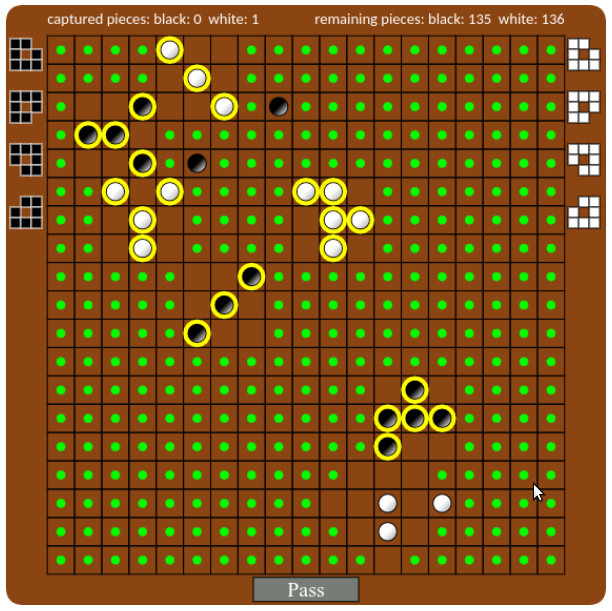
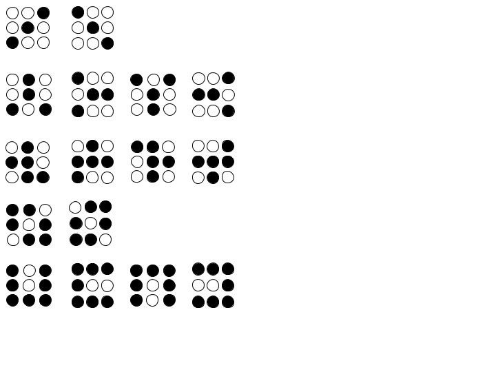

# Kikotsoka

## Description

### Contexte

Module: Agilité  
Master 1 WebScI, Université du Littoral Côte d'Opale  
Encadrant: \[Éric Ramat\], Professeur [page web](https://eramat.gitlab.io/homepage/)  

### Énoncé

On souhaite développer un jeu abstrait. On développera uniquement le moteur de jeu (__engine__).  
Le jeu se nomme Kikotsoka. L’objectif est d’atteindre le statut de “dieu” (Kami en japonais) en
passant par 4 autres statuts intermédiaires (origine, enfant, homme et prêtre). Ces statuts s’obtiennent en formant des patterns à l’aide de pions.  
Il se compose d’un plateau composé de cases. Plusieurs tailles sont possibles (12, 16 et 19) mais dans notre cas on considère que le plateau se limite à 12 x 12 cases.  

Pour information, voici les différents patterns a réaliser pour gagner une partie:

- 3 pions : ki (origine / kigen)

- 4 pions : ko (enfant / kodomo)

- 5 pions : ot (homme / otoko)

- 6 pions : so (prêtre / sõryo)

- 7 pions : ka (dieu / kami)

### Quelques règles

- Le joueur Noir joue en premier

- Chaque joueur dispose de 60 pions

- Lorsqu'un pattern est formé, tout les cases englobant le Patterns sont verrouillés (Plus aucun pions ne pourra être posé)

- Lorsqu'un pattern est formé, les pions du joueur adverse englobant le pattern sont capturés et augmente le score du joueur d'autant

- Lorsqu'un pattern est formé, le joeur monte d'un niveau

- Lorsqu'un joueur est au niveau 1 est qu'il place un pion, il bloque les cases adjacentes pour l'adversaire durant un tour

- Un joueur ne peut pas former un pattern de niveau inférieur ou supérieur au sien actuel

### Dérouler

Le projet a été développé dans une démarche de développement dirigé par les tests (Test Driven Development).  
23 user stories ont été décrites, et pour chacune de ces storie on suit le protocole suivant:

- Écrire le test

- L'éxecuter: le test doit échouer

- Écrire le code qui permet de faire réussir le test

- Lancer le test: le test doit réussir

- Réusiner le code

### Images





### Fonctionnalitées

#### Fait

- Rédaction des tests

- Développement de l'engine
  - Func 2.1
  - Func 2.2

#### À faire / Souhaitées (Idées)

- Interface Graphique

- Développer un IA adverse

## Utilisation

### Dépendances

[gcc](https://gcc.gnu.org/)  
[CMake](https://cmake.org/cmake/help/latest/guide/tutorial/index.html)  
[Makefile](http://www.gnu.org/software/make/manual/make.html#Introduction)  
[Catch](https://github.com/catchorg/Catch2)  

### Installation / Compilation

```bash
cd kikotsoka
mkdir build
cmake --build build/
```

### Lancement (run)

```bash
./build/test/kikotsoka-cpp-test
```

#### Help

### À savoir
